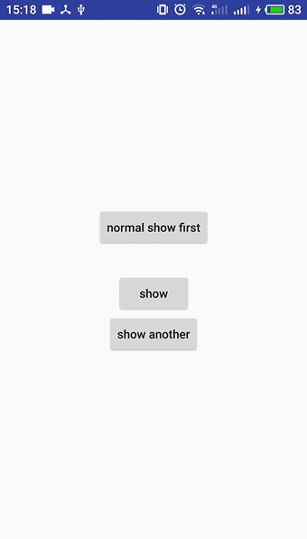
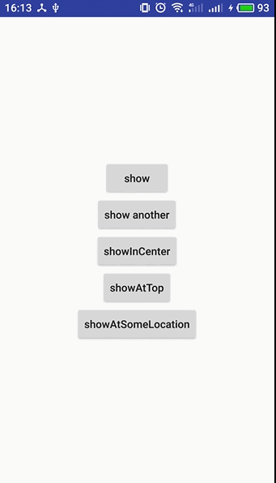

# SmartShow
Smart Toast & Snackbar : 简化调用，并处理常见问题，提高性能和用户体验！作者：朱志强 
## 添加依赖
1.在Project的gradle文件中 
<pre><code>
allprojects {

    repositories {

        ...

        maven { url 'https://jitpack.io' }

    }

}
</code></pre>
2.在Module的grable文件中 
<pre></code>

    compile ( 'com.github.the-pig-of-jungle:SmartShow:v1.0.0' ){

        //去除design包的依赖，其一，你不一定用到SmartSnackbar；其二，你项目使用的版本不一定和库中使用的相同

        exclude group: 'com.android.support'

    }

    //若要使用SmartSnackbar，还需添加design包的依赖，添加适合你项目的版本即可

    compile 'com.android.support:design:x.y.z'
</code></pre>
## SmartToast部分
### 特点：
1.全局始终使用一个Toast实例，节省内存 
2.如果Toast正在显示，多次触发同一内容的Toast，不会重复弹出 
3.新的Toast(内容或位置发生了变化)来临时，会立即弹出，不会等到当前显示的Toast的duration耗尽再弹出，虽不会创建新的Toast实例，但具有切换效果 
4.可对Toast原有布局的风格进行修改，如背景颜色，文字大小和颜色等 
5.可为Toast设置自定义布局，并进行代码处理 
6.内部实现上,除了所必须的Toast单例外，为了减少创建不必要的对象，PlainToastSetting、CustomToastSetting、Runnable三个接口全部由单例SmartToast实现，对外需要暴露何种功能，则返回何种接口类型
### 使用：
第一步，必须初始化，在Application的onCreate()方法中初始化 
方式 1： 
<pre><code>
        //使用默认布局的普通Toast

        SmartToast.plainToast(this);
</code></pre>
如果你想对布局风格进行修改,可继续链式调用，不过这并不是必须的 
<pre><code>
        //返回PlainToastSetting对象，对布局进行各种风格设置

        SmartToast.plainToast(this)

                /*

                设置背景颜色，有可选方法，可直接以颜色值为参数。Toast的默认背景是一个圆角图片，当你设置了背景颜色时，

                原有背景失效，我们内部用ShapeDrawable实现背景，可以保证大小与你手机系统Toast一致，但是不同品牌手机的

                Toast的圆角半径不尽相同，将统一使用2.5dp

                */

                .backgroundColorRes(R.color.colorPrimary)

                //设置文本颜色，有可选方法，可直接以颜色值为参数

                .textColorRes(R.color.colorAccent)

                //设置文本字体大小，单位为sp

                .textSizeSp(17)

                //设置是否加粗文本

                .textBold(true)

                //如果以上还不够，可调用此方法

                .processPlainView(new ProcessViewCallback() {

                    //outParent为显示文本的TextView的父布局，msgView为显示文本的TextView

                    @Override
                    public void processPlainView(LinearLayout outParent, TextView msgView) {

                        //处理代码

                        ...

                        msgView.getPaint().setFlags(Paint.UNDERLINE_TEXT_FLAG);

                    }
                });
</code></pre>
方式 2： 
<pre><code>
        使用自定义布局的Toast

        SmartToast.customToast(this)

                        /*

                        设置自定义布局，有重载方法，可直接以View为参数。在你的自定义布局中，一定要设置显示文本提示的

                        TextView的Id为android:id="@id/custom_toast_msg"。如果不调用该方法，那么上面的调用与

                        SmartToast.plainToast(this)等效

                        */

                        .view(R.layout.custom_toast);
</code></pre>
如果你想对自定义的布局进行代码处理,可继续链式调用，不过这并不是必须的 
<pre><code>
        返回CustomToastSetting对象

        SmartToast.customToast(this)

                //填充布局

                .view(R.layout.custom_toast)

                //对自定义布局进行代码处理

                .processCustomView(new ProcessViewCallback() {

                    @Override
                    public void processCustomView(View view) {

                        //处理代码

                        ...

                    }
                });
</code></pre>
第二步，调用show方法显示Toast，非常简便 
Short Toast 
<pre><code>
        //在默认位置显示

        SmartToast.show("我是朱志强！");

        //在屏幕顶部显示，距离顶部位置为Toast在Y方向默认的偏移距离

        SmartToast.showAtTop("我是朱志强!");

        //在屏幕中央显示

        SmartToast.showInCenter("我是朱志强！");

        //在指定位置显示，x,y方向偏移量单位为dp

        SmartToast.showAtLocation("我是朱志强",Gravity.LEFT | Gravity.TOP,10,10);
</pre></code>
Long Toast 
<pre><code>
        //在默认位置显示

        SmartToast.showLong("我是朱志强！");

        //在屏幕顶部显示，距离顶部位置为Toast在Y方向默认的偏移距离

        SmartToast.showLongAtTop("我是朱志强!");

        //在屏幕中央显示

        SmartToast.showLongInCenter("我是朱志强！");

        //在指定位置显示，x,y方向偏移量单位为dp

        SmartToast.showLongAtLocation("我是朱志强",Gravity.LEFT | Gravity.TOP,10,10);
</code></pre>

<pre><code>
         //隐藏Toast

         SmartToast.dismiss();
</code></pre>
### 实现
1.全局使用一个Toast。 
Toast的视图是通过独立的Window来显示的，并不依赖于任何Activity，在任何Activity未启动的情况下，依然可以显示Toast。所以用Application
级的Context创建Toast，就可以全局使用一个Toast实例了。 
2.如果Toast正在显示，多次触发同一内容的Toast，不会重复弹出 
全局使用一个Toast实例即可解决此问题。同一Toast实例，如果当前正在显示，再次调用show方法，并不会重复弹出。 
3.新的Toast(内容或位置发生了变化)来临时，会立即弹出，不会等到当前显示的Toast的duration耗尽再弹出，虽不会创建新的Toast实例，但具有切换效果 
很容易会想到这么做，全局使用一个Toast实例的基础上，然后如此写代码： 
<pre><code>
    public void onNormalShowFirstClick(View view) {

        mToast.setText("Showing!");

        mToast.show();

    }

    public void onShowClick(View view) {

        mToast.cancel();

        mToast.setText("苹果!");

        mToast.show();

    }

    public void onAnotherShow(View view) {

        mToast.cancel();

        mToast.setText("香蕉!");

        mToast.show();

    }
</code></pre>
然而很遗憾，这么做无济于事。没有Toast显示时，先后调用cancel和show不会显示Toast。当前正在显示Toast时，先后调用cancel和
show，虽会显示，但新的Toast(新内容或新位置)不会显示足额时间便消失，体验不好。 
 
你还有可能这么实现： 
<pre><code>
    public void onShowClick(View view) {

        mToast.setText("苹果!");

        mToast.show();

    }

    public void onAnotherShow(View view) {

        mToast.setText("香蕉!");

        mToast.show();

    }

    public void onShowInCenterClick(View view) {

        mToast.setGravity(Gravity.CENTER,0,0);

        mToast.setText("桔子!");

        mToast.show();

    }
</code></pre>
但这样会有两个问题,内容改变后没有切换效果，如果Toast正在显示，调用setText可以立即生效，但setGravity并不是立即生效，
要等到下一次显示才生效，就导致本次位置改变失败。 
 
之所以出现这样的问题，与Toast的显示原理有关。 
调用Toast的show方法时，内部会做两件事，一是显示视图，而是将Toast加入队列，待duration耗尽后移除。调用cancel方法时，一是
视图消失，二是将Toast从队列移除。但是前者执行完后只是发起移除队列的行为，移除代码不一定紧接着执行，代码会继续往下走，执行其他任务。
如果此时再次调用show方法，视图得以显示，然后紧接着执行移除代码，Toast很快消失。 
Toast视图的显示和消失是交给内部类TN管理的，并保存为成员变量，我们通过反射拿到TN，然后每次都只隐藏视图，不发起队列移除操作，问题就解决了。
<pre><code>
   public static void dismiss() {

        if (sSmartToast != null && sSmartToast.mToast != null) {

            try {

                Field tnField = Toast.class.getDeclaredField("mTN");

                tnField.setAccessible(true);

                Object tn = tnField.get(sSmartToast.mToast);

                Method hideMethod = tn.getClass().getDeclaredMethod("hide");

                hideMethod.setAccessible(true);

                hideMethod.invoke(tn);

            } catch (NoSuchFieldException e) {
                e.printStackTrace();
            } catch (IllegalAccessException e) {
                e.printStackTrace();
            } catch (NoSuchMethodException e) {
                e.printStackTrace();
            } catch (InvocationTargetException e) {
                e.printStackTrace();
            }
        }
    }
</code></pre>
show方法逻辑
<pre><code>
 private static void showHelper(CharSequence msg, int gravity, int xOffset, int yOffset, int duration) {

        if (sSmartToast.mCustomView != null && sSmartToast.mCustomMsgView == null) {

            return;

        }

        msg = msg == null ? "" : msg;

        getToast().setDuration(duration);

        //位置是否改变

        boolean locationChanged = sSmartToast.locationChanged(gravity, xOffset, yOffset);

        //内容是否改变

        boolean contentChanged = !sSmartToast.mCurMsg.equals(msg);

        sSmartToast.mCurMsg = msg;

        sSmartToast.mGravity = gravity;

        sSmartToast.mXOffset = xOffset;

        sSmartToast.mYOffset = yOffset;

        //如果Toast正在显示，且内容或位置发生了变化

        if (ViewCompat.isAttachedToWindow(getToast().getView()) && (contentChanged || locationChanged)) {

            //先隐藏

            SmartToast.dismiss();

            //再显示，为了体验更好，延时150毫秒发送Runnable执行

            getToast().getView().postDelayed(sSmartToast, 150);

        } else {

            //否则更新Toast的内容并正常显示即可

            sSmartToast.updateToast();

            getToast().show();

        }

    }
</code></pre>
<pre><code>
    @Override
    public void run() {

        updateToast();

        getToast().show();

    }
</code></pre>
<pre><code>
    private void updateToast() {

        if (mCustomMsgView != null) {

            mCustomMsgView.setText(mCurMsg);

        } else {

            getToast().setText(mCurMsg);

        }

        getToast().setGravity(mGravity, mXOffset, mYOffset);

    }
</code></pre>
测试下
<pre><code>
    public void onShowClick(View view) {
        SmartToast.show("苹果！");
    }

    public void onAnotherShow(View view) {
        SmartToast.show("香蕉！");
    }

    public void onShowInCenterClick(View view) {
        SmartToast.showInCenter("桔子！");
    }
</code></pre>
 
### 效果图

## SmartSnackbar部分
### 特点：
1.Snackbar的原理与Toast不同，Toast内部通过Window显示，全局可复用一个实例，Snackbar是把视图内嵌到当前Activity的android.R.id.content容器或某个CoordinatorLayout中，但在获取方式不变（容器不变）的情况下，同一页面仍然可以复用一个Snackbar实例，节省内存 
2.同一页面，如果Snackbar正在显示，再次触发同一内容的Snackbar，不会重复弹出 
3.同一页面，如果Snackbar正在显示，再次触发Snackbar，如果内容发生了变化（不会重建Snackbar实例）或内嵌的容器发生了变化（会重建Snackbar实例），会重新弹出，具有切换效果。 
4.可对布局的风格进行修改，如背景颜色，文字大小和颜色等 
5.内部实现上,除了必要的Snackbar，为了减少创建不必要的对象，SnackbarSetting、SnackbarShow、Runnable,View.OnClickListener四个接口全部由单例SmartSnackbar实现，对外需要暴露何种功能，则返回何种接口类型
### 使用：
第一步，初始化。这不是必须的，如果你想对Snackbar的风格进行修改，则在Application的onCreate()方法中初始化 
<pre><code>
        //返回SnackbarSetting对象，对布局进行各种风格设置

        SmartSnackbar.init(this)

                //设置背景颜色，有可选方法，可直接以颜色值为参数

                .backgroundColorRes(R.color.colorPrimary)

                //设置消息文本颜色，有可选方法，可直接以颜色值为参数

                .msgTextColorRes(R.color.white)

                //设置动作文本颜色，有可选方法，可直接以颜色值为参数

                .actionColorRes(R.color.colorAccent)

                //设置消息文本字体大小，单位为sp

                .msgTextSizeSp(18)

                //设置动作文本字体大小，单位为sp

                .actionSizeSp(18)

                //如果以上还不够，可调用该方法进行处理

                .processView(new ProcessViewCallback() {

                    @Override
                    public void processSnackbarView(Snackbar.SnackbarLayout layout,

                     TextView msgView, TextView actionView) {

                        //处理代码

                        ...

                    }
                });
</code></pre>
第二步，在你BaseActivity的onDestroy()方法里回收资源
<pre><code>
    @Override
    protected void onDestroy() {

        super.onDestroy();

        /*

        如果当前页面创建过Snackbar，则退出页面时，回收资源。如果没有，则不会回收资源，比如Activity A 显示过Snackbar，然后

        启动了B，B没有显示过Snackbar，当B销毁回到A时，再显示Snackbar，可复用，不用再次创建，提高效率

        */

        SmartSnackbar.destroy(this);
    }
</code></pre>
第三步，获取当前页面的Snackbar，并调用show方法显示 
Short Snackbar 
<pre><code>
        //传入Activity，获取当前页面的Snackbar，显示消息

        SmartSnackbar.get(this).show("我是朱志强");
</code></pre>
Long Snackbar 
<pre><code>
        //传入Activity，获取当前页面的Snackbar，显示消息

        SmartSnackbar.get(this).showLong("我是朱志强");
</code></pre>
Indefinite Snackbar 
<pre><code>
        //传入Activity，获取当前页面的Snackbar，显示消息和动作文本，传入点击动作文本的回调代码

        SmartSnackbar.get(this).showIndefinite("我是朱志强", "打赏", new View.OnClickListener() {

            @Override
            public void onClick(View v) {

                Log.d("SmartShow","Thank you !");

            }
        });

        //传入Activity，获取当前页面的Snackbar，显示消息和动作文本，不传第三个参数，默认行为为Snackar消失

        SmartSnackbar.get(this).show("我是朱志强","打赏");
</code></pre>

显示Short和Long Snackbar时，通常不会显示动作文本，而Indefinite Snackbar通常不会只显示消息文本，但实际上该库为三种Snackbar均提供了以上参数个数为1或2或3的方法。

<pre><code>

        //隐藏当前Snackbar

        SmartSnackbar.dismiss();
</code></pre>

#### SmartSnackbar获取方式的说明
以上实例使用的是public static SnackbarShow get(Activity activity)方式， 
还可使用public static SnackbarShow get(CoordinatorLayout view)方式。 
根据谷歌源码，我们知道创建Snackbar时需传入一个当前页面的某个View，实际上，Snackar会以该View为基点，沿着整个View Tree上溯，直到找到CoordinatorLayout容器或android.R.id.content
容器，将视图嵌入其中。为了提高效率，直接将android.R.id.content或者CoordinatorLayout传入会更好。 
以CoordinatorLayout为内嵌容器时，Snackbar会有一些特殊的行为，如可以用手指手动滑动移除，显示时会导致FloatActionButton升高等。
所以建议，在使用SmartSnackbar时，如果你的页面想以某个具体CoordinatorLayout作为容器，则调用public static SnackbarShow get(CoordinatorLayout view)。否则调用public static SnackbarShow get(Activity activity)，内部会自动将
android.R.id.content作为容器。 
